# 🏛️ KCT 웹 플랫폼 아키텍처 (Architecture & Technical Specs)

본 문서는 **한국건설트레이딩 (KCT)** 웹 플랫폼의 시스템 아키텍처, 정보 구조도(IA), UI 컴포넌트 설계 및 상태 관리 방식을 정의합니다.

---

## 🗺️ 1. 정보 구조도 (Information Architecture)

```mermaid
graph TD
    Root[KCT Global Web Platform] --> Nav[Global Navigation Bar / Header]
    Root --> Home[메인 홈페이지 /]
    Root --> About[회사소개 /about]
    Root --> AppSec[적용분야 /applications]
    Root --> ProdSec[제품정보 /products]
    Root --> TechSec[기술지원 & 계산기 /tech-center]
    Root --> ContactSec[B2B 견적 & 문의 /contact]
    Root --> Footer[Footer & Legal & Network]

    AppSec --> App1[커튼월 & 외장 패널]
    AppSec --> App2[창호 & 유리 글레이징]
    AppSec --> App3[복층유리 2차 실링]
    AppSec --> App4[인테리어 & 욕실/방균]
    AppSec --> App5[방화 & 내화 구획 실링]
    AppSec --> App6[토목 & 도로 조인트]

    ProdSec --> Prod1[구조용 실란트 Dow 983 / 895]
    ProdSec --> Prod2[내후성 실란트 Dow 791 / 991]
    ProdSec --> Prod3[복층유리용 실란트 Dow 3362]
    ProdSec --> Prod4[방화용 실란트 Firestop 700]
    ProdSec --> Prod5[바이오/무초산 범용 실란트]

    TechSec --> Calc[조인트 소요량 자동 계산기]
    TechSec --> TDS[TDS/MSDS 기술자료실]
    TechSec --> FAQ[실리콘 시공 하자방지 FAQ]
```



---

## 🎨 2. UI 컴포넌트 아키텍처 (Component Hierarchy)

```
[ KCT Main Container Layout ]
  ├── 1. Header & Navigation Component
  │    ├── Brand Logo (KCT Korea Construction Trading)
  │    ├── Mega Menu (회사소개, 적용산업, 제품소개, 기술지원, 견적요청)
  │    ├── Language Selector (KO / EN / JA)
  │    └── Quick Contact CTA (WhatsApp / Call)
  │
  ├── 2. Hero Banner Component
  │    ├── Parallax Background Image (High-rise Facade & Construction)
  │    ├── Hero Headline & Value Proposition
  │    └── Action Buttons (B2B 견적 요청, 적용산업 둘러보기)
  │
  ├── 3. Trust Bar Component
  │    ├── 사업자등록번호 및 인증 현황 (371-07-03719)
  │    ├── Dow Chemical 및 프리미엄 소싱 파트너십
  │    └── 수도권 당일/익일 & 전국 2~3일 직납 시스템
  │
  ├── 4. Applications (적용산업) Showcase Component [KCC실리콘 벤치마크]
  │    ├── Category Filter Tabs (전체, 커튼월, 창호, 복층유리, 방화, 인테리어, 토목)
  │    ├── Interactive Solution Card Grid (이미지, 솔루션명, 핵심 물성, 추천 제품)
  │    └── Solution Detail Modal / Direct Link
  │
  ├── 5. Products Catalog & Spec Table Component
  │    ├── Product Grid with Dynamic Badges (내후성, 구조용, 방화, KS인증)
  │    ├── Comparison Spec Matrix (경화타입, 모듈러스, 인장강도, 신율)
  │    └── Technical Sheet (TDS/MSDS) Instant Download
  │
  ├── 6. Interactive Silicone Volume Calculator Component
  │    ├── Visual Joint Dimension Diagram (폭 W × 깊이 D × 길이 L)
  │    ├── Real-time Dynamic Result Display (부피 L, 카트리지 300ml 수, 소시지 500ml 수)
  │    └── 1-Click Quote Transfer Button (계산된 수량을 견적서 폼으로 자동 복사)
  │
  ├── 7. B2B Order Process & Inquiry Form Component
  │    ├── 4-Step Intuitive Order Flow (문의 ➔ 견적 ➔ 발주 ➔ 빠른납품)
  │    ├── Comprehensive B2B Quote Form (회사명, 담당자, 연락처, 현장위치, 필요자재)
  │    └── Google Map Location (Garden Five Tools 본사)
  │
  └── 8. Footer Component
       ├── KCT Corporate Info & Legal Disclaimers
       ├── Direct Contact Points (Sales Hotline, WhatsApp, Email)
       └── Social / Naver Smartstore Links
```

---

## 📐 3. 실리콘 소요량 계산기 알고리즘 (Calculator Formula)

실제 건설 현장에서 사용하는 표준 실리콘 조인트 체적 공식:

$$\text{단위 길이당 부피(ml/m)} = \text{폭(mm)} \times \text{깊이(mm)} \times 1.0$$
$$\text{총 부피(L)} = \frac{\text{폭(mm)} \times \text{깊이(mm)} \times \text{길이(m)}}{1,000} \times 1.10 \quad (\text{현장 손실/할증률 10\% 적용})$$

$$\text{필요 카트리지 수 (300ml)} = \lceil \frac{\text{총 부피(ml)}}{300} \rceil$$
$$\text{필요 소시지 수 (500ml)} = \lceil \frac{\text{총 부피(ml)}}{500} \rceil$$
$$\text{필요 대용량 소시지 수 (600ml)} = \lceil \frac{\text{총 부피(ml)}}{600} \rceil$$
